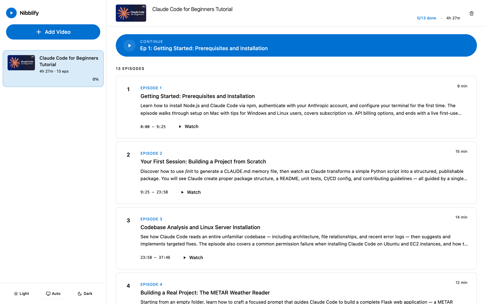
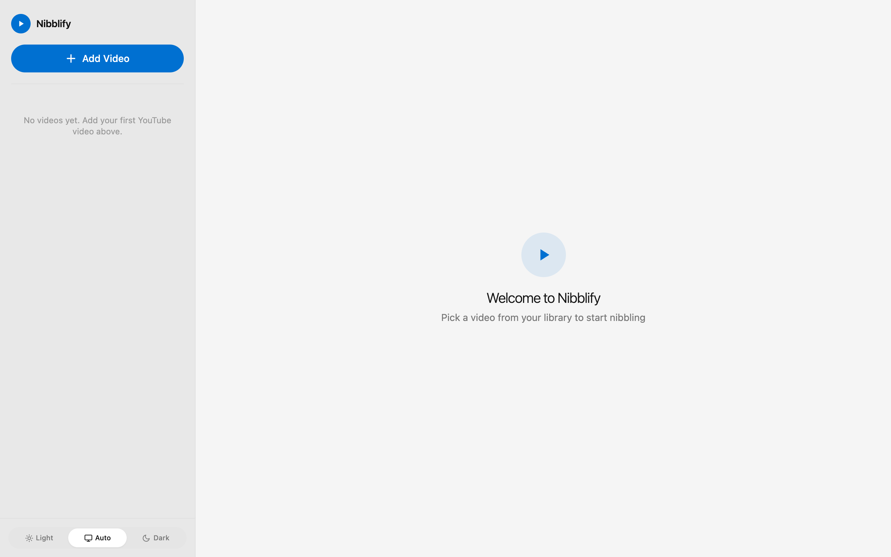
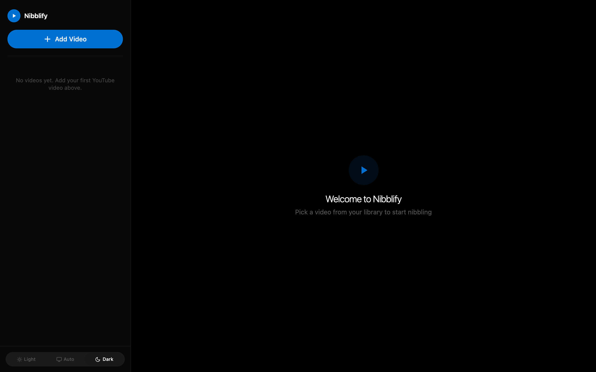

# Nibblify 🎬

Turn any long YouTube video into bite-sized daily episodes — powered by Claude AI.

Paste a YouTube URL and Nibblify splits it into smart episodes (10–30 min each) based on the content's natural structure. Watch one episode a day, mark it done, and actually finish those 4-hour tutorials you keep pausing.

---

## Screenshots

| Episode list | Light mode | Dark mode |
|:---:|:---:|:---:|
|  |  |  |

---

## How it works

1. **Add a video** — paste any YouTube URL with captions
2. **Claude analyses the transcript** and creates logical episodes with titles and summaries
3. **Watch one episode a day** using the built-in player (stops automatically at the episode end)
4. **Mark episodes done** and track your overall progress

---

## Prerequisites

Install these three tools before running the installer:

| Tool | Why | Download |
|------|-----|----------|
| **Claude Code** | Generates the episode breakdowns — no API key needed | https://claude.ai/code |
| **Python 3.11+** | Runs the backend | https://python.org/downloads |
| **Node.js 18+** | Runs the frontend | https://nodejs.org |

Verify everything is ready:
```bash
claude --version
python3 --version   # Mac / Linux
python --version    # Windows
node --version
```

---

## Installation

### Mac / Linux — one command

```bash
curl -fsSL https://raw.githubusercontent.com/mukundmurali-mm/nibblify/master/install.sh | bash
```

The script checks your prerequisites, downloads Nibblify, installs all dependencies, and tells you exactly how to start it.

> **Prefer to inspect first?**
> ```bash
> curl -fsSL https://raw.githubusercontent.com/mukundmurali-mm/nibblify/master/install.sh -o install.sh
> cat install.sh          # read it
> bash install.sh         # run it
> ```

### Windows — one command (PowerShell)

```powershell
irm https://raw.githubusercontent.com/mukundmurali-mm/nibblify/master/install.ps1 | iex
```

> If you see an execution-policy error, run this first, then retry:
> ```powershell
> Set-ExecutionPolicy -Scope CurrentUser RemoteSigned
> ```

### After installation — start the app

**Mac / Linux:**
```bash
cd ~/nibblify && ./start.sh
```

**Windows:**
```bat
cd %USERPROFILE%\nibblify
start.bat
```

Then open **http://localhost:5173** in your browser.

---

## Updating

Run the same install command again — it detects an existing installation and does a `git pull` instead of a fresh download.

---

## Manual setup (if the installer doesn't work)

### Backend

```bash
cd ~/nibblify/backend          # or %USERPROFILE%\nibblify\backend on Windows

# Mac/Linux
python3 -m venv .venv
source .venv/bin/activate
pip install -r requirements.txt
uvicorn main:app --reload --port 8000

# Windows
python -m venv .venv
.venv\Scripts\activate
pip install -r requirements.txt
.venv\Scripts\uvicorn main:app --reload --port 8000
```

### Frontend

Open a second terminal:

```bash
cd ~/nibblify/frontend         # or %USERPROFILE%\nibblify\frontend on Windows
npm install
npm run dev
```

Then open **http://localhost:5173**.

---

## Which YouTube videos work?

Nibblify needs the video to have **captions/subtitles** (auto-generated or manual). Most educational videos on YouTube have these.

Videos that work well:
- Programming tutorials
- Lecture recordings
- Course content
- Conference talks
- Documentary-style educational videos

Videos that won't work:
- Videos with captions disabled
- Music videos
- Videos in languages where auto-captions aren't available

---

## App layout

```
┌─────────────────┬────────────────────────────────────┐
│  Sidebar        │  Episode list                      │
│  (your library) │  ─────────────────────────────     │
│                 │  Ep 1 · Introduction       [Watch] │
│  📹 Video 1     │  Ep 2 · Core Concepts      [Watch] │
│  ████░░ 60%     │  Ep 3 · Advanced Topics    [Watch] │
│                 │  ─────────────────────────────     │
│  📹 Video 2     │  ┌────────────────┬─────────────┐  │
│  ██░░░░ 30%     │  │ Inline player  │ Progress    │  │
│                 │  │                │ ██████░ 65% │  │
│  [+ Add Video]  │  │                │             │  │
│                 │  │                │ [Full screen]│  │
│                 │  └────────────────┴─────────────┘  │
└─────────────────┴────────────────────────────────────┘
```

- **Sidebar** — your full video library with per-video progress
- **Episode list** — all episodes for the selected video; click the circle to mark done
- **Inline player** — plays the episode with the exact start/end time; shows episode-specific progress
- **Full screen** — opens a dedicated player view (Esc to exit)

---

## Frequently asked questions

**How long does it take to process a video?**  
Usually 30–60 seconds. Claude reads the full transcript and generates episode titles, summaries, and timestamps.

**Will the episodes always stop at the right time?**  
Yes — the app uses YouTube's embed API with `start` and `end` parameters, and layers its own episode progress bar on top. Use **"Watch in full screen"** inside the app (not YouTube's own fullscreen button) to keep progress tracking active.

**Where is my data stored?**  
Everything is local. The SQLite database lives at `backend/learner.db` on your machine. No data is sent anywhere except to YouTube (to fetch the transcript) and to your local Claude Code CLI.

**Can I delete a video?**  
Yes — open the video's episode list and click the trash icon in the top-right corner.

**What if I want to re-watch an episode I already marked done?**  
Click the blue circle next to any episode to toggle it back to in-progress. You can also do this from inside the player with the **"Mark as in progress"** button.

---

## Tech stack

| Layer | Technology |
|-------|-----------|
| Backend | Python · FastAPI · SQLite (via SQLAlchemy) |
| AI | Claude Code CLI (`claude -p`) — no API key needed |
| YouTube | `youtube-transcript-api` · YouTube oEmbed · YouTube IFrame API |
| Frontend | React 18 · Vite · Tailwind CSS |

---

## Troubleshooting

**`claude: command not found`**  
Install Claude Code from https://claude.ai/code and make sure it's in your PATH (`claude --version` should work).

**`No transcript available for this video`**  
The video doesn't have captions. Try a different video, or enable auto-captions on the YouTube video settings if it's your own content.

**Port already in use**  
Something else is running on port 8000 or 5173. Stop the other process, or edit `start.sh` / `start.bat` and `frontend/vite.config.js` to use different ports.

**Python venv errors on Windows**  
Run `Set-ExecutionPolicy -Scope CurrentUser RemoteSigned` in PowerShell first, then retry.

**Frontend shows blank page**  
Make sure the backend is running on port 8000 — the frontend proxies all `/api` requests to it.
